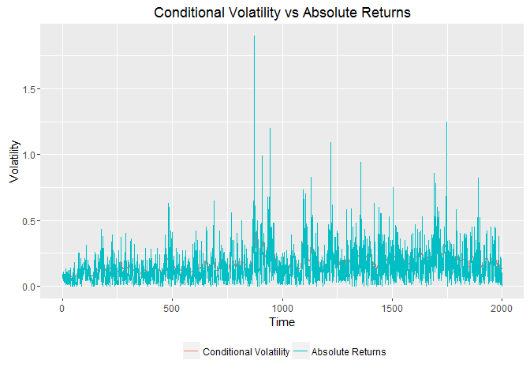
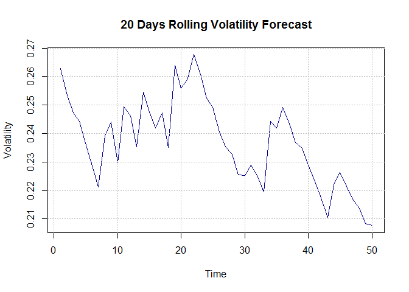
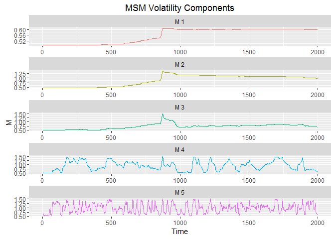
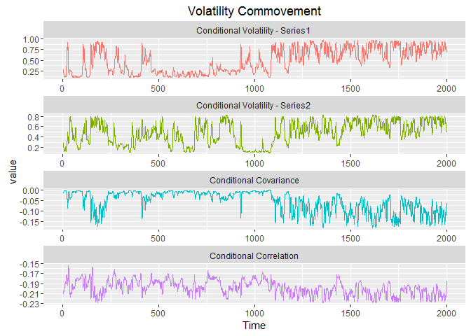
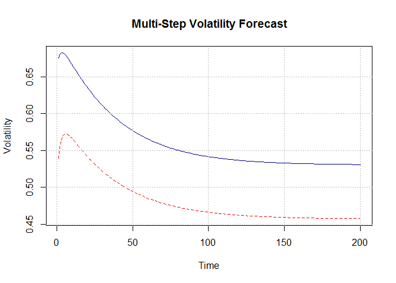
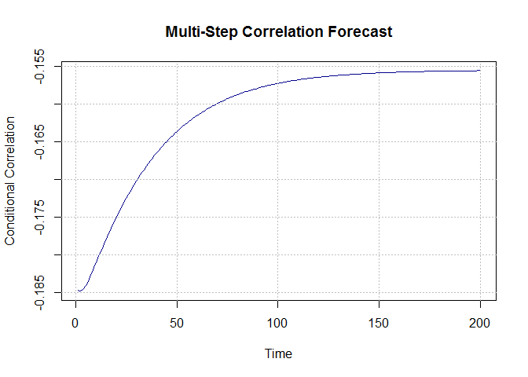
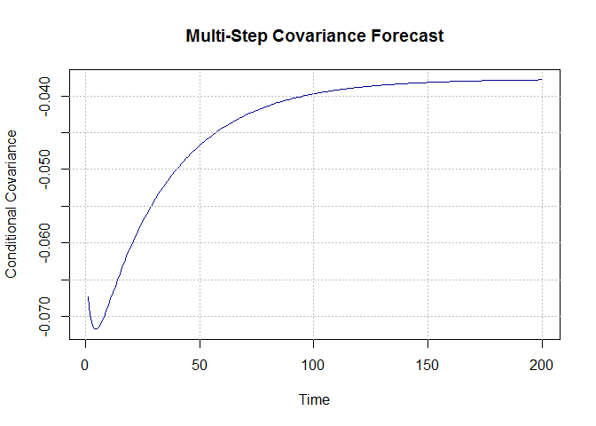

R Package for Markov Switching Multifractal Models
================

<!-- README.md is generated from README.Rmd. Please edit that file -->
The Markov-Switching Multifractal Model
---------------------------------------

The Markov Switching Multifractal model is a stochastic volatility model in which conditional volatility is defined as a product of finitely many latent volatility state variables (called volatility components or frequency components), with varying degrees of persistence. Let *r*<sub>*t*</sub> ≡ ln(*P*<sub>*t*</sub>/*P*<sub>*t* − 1</sub>). Then *r*<sub>*t*</sub> is defined as

*r*<sub>*t*</sub> = *σ*(*M*<sub>1, *t*</sub> \* *M*<sub>2, *t*</sub> \* *M*<sub>3, *t*</sub> \* ....*M*<sub>*k*, *t*</sub>)<sup>1/2</sup>*ε*<sub>*t*</sub>
 where *ε*<sub>*t*</sub> is *i.i.d.* standard Gaussian 𝒩(0, 1) and *σ* is a positive constant, and corresponds to the unconditional standard deviation of returns. The univariate MSM(k) model is characterized by four paramaters (*m*<sub>0</sub>, *b*, *γ*<sub>*k*</sub>, *σ*), where

-   *m*<sub>0</sub> ∈ (1, 2\]: determines the size of each volatility component.

-   *b* ∈ (1, ∞): controls the probability of switching in each volatility component.

-   *γ*<sub>*k*</sub> ∈ (0, 1): controls the spacing between different volatility components.

-   *σ* ∈ \[0, ∞\]: unconditional standard deviation.

For more details on the MSM literature, see (L. Calvet, Fisher, and Mandelbrot 1997; L. Calvet and Fisher 2001; L. Calvet and Fisher 2002; L. E. Calvet and Fisher 2004) and (L. E. Calvet, Fisher, and Thompson 2006)

The MSM Package
---------------

This package provides the estimation and forecasting of volatility, using the MSM model. The basic useage is:

    #> Loading required package: Rsolnp
    #> Loading required package: reshape2
    #> Loading required package: ggplot2
    #>      canret        
    #>  Min.   :-1.25000  
    #>  1st Qu.:-0.11000  
    #>  Median : 0.01000  
    #>  Mean   : 0.00942  
    #>  3rd Qu.: 0.12000  
    #>  Max.   : 1.90000
    #> *----------------------------------------------------------------------------*
    #>   Markov Switching Multifractal Model With 1 Volatility Component(s) 
    #> *----------------------------------------------------------------------------*
    #> 
    #>        Estimate Std. Error t.value p.value    
    #> m0       1.6618     0.0177  93.810  <2e-16 ***
    #> b            NA         NA      NA      NA    
    #> gammak   0.0797     0.0160   4.975  <2e-16 ***
    #> sigma    0.2190     0.0031  71.734  <2e-16 ***
    #> ---
    #> Signif. codes:  0 '***' 0.001 '**' 0.01 '*' 0.05 '.' 0.1 ' ' 1
    #> 
    #> LogLikelihood: -456.9057

Note that for *k* = 1, *b* is undefined. Hence, the reason why *b* is NA above. The choice of *k*, i.e. the number of volatility components, is a model selection problem that can be implemented using Vuong test. Alternatively, several models with different number of volatility components can be tested, using one of the many tests of volatility forecast accuracy. Then the model with the best accuracy can be selected. Two caveats are in order here. First volatility is not directly observable. Hence, extreme care is required in choosing the best model that fits the purpose of the volatility forecasting exercise. Second and most importantly, the higher the number of volatility components, the bigger the transition matrix. For example, for *k* = 10, the transition matrix is of size 2<sup>*k*</sup> by 2<sup>*k*</sup> with 1,048,576 elements. This combined with the fact that the conditional probabilities have to be computed recursively, makes the estimation process for large *k*s very expensive in terms of memory requirements and estimation time. Therefore, care needs to be excercised in the choice of *k*. Although a substantial part of the package is written in C++ to speed up execution, it is strongly recommended to keep *k* &lt; =10

Let's continue by specifying a full model as follows, with *k* = 5:

``` r
fit <- Msm(ret, kbar=5, n.vol=252, nw.lag=2)
summary(fit)
#> *----------------------------------------------------------------------------*
#>   Markov Switching Multifractal Model With 5 Volatility Component(s) 
#> *----------------------------------------------------------------------------*
#> 
#>        Estimate Std. Error t.value p.value    
#> m0       1.5083     0.0266  56.780  <2e-16 ***
#> b        4.9436     1.3273   3.725  0.0002 ***
#> gammak   0.1246     0.0399   3.127  0.0018 ** 
#> sigma    0.4185     0.0354  11.812  <2e-16 ***
#> ---
#> Signif. codes:  0 '***' 0.001 '**' 0.01 '*' 0.05 '.' 0.1 ' ' 1
#> 
#> LogLikelihood: -514.4351
```

Univariate MSM results can be plotted as follows:



We can get fitted volatility values as follows:

``` r
yhat <- predict(fit)
cbind(head(yhat$vol), head(yhat$vol.sq))
#>            [,1]        [,2]
#> [1,] 0.09043538 0.008178558
#> [2,] 0.08690108 0.007551798
#> [3,] 0.08460322 0.007157705
#> [4,] 0.08088403 0.006542226
#> [5,] 0.07861029 0.006179577
#> [6,] 0.07715423 0.005952775
```

Get h-step ahead volatility forecast:

``` r
yhat <- predict(fit, h = 1)
unlist(yhat)
#>        vol     vol.sq 
#> 0.14437965 0.02084548
yhat <- unlist(predict(fit, h = 10))
unlist(yhat)
#>       vol    vol.sq 
#> 0.1845671 0.0340650
```

Get multi-step ahead volatility values up to the next 100 days:

``` r
library(foreach)
library(doParallel)
#> Loading required package: iterators
#> Loading required package: parallel
cl <- makeCluster(4)
registerDoParallel(cl)
```

``` r
vhat <- foreach(t = 1:100, .combine = rbind, .packages = "MSM") %dopar% {
    t(as.matrix(unlist(predict(fit, h = t))))
}
```

``` r
plot(vhat[,1], type = "l", col = "darkblue"
        ,ylab = "Volatility", xlab = "Time",main= "Multi-Step Volatility Forecast")
grid(col = "grey")
```


Get rolling 20 days ahead volatility forcasts for the next 50 periods:

``` r
vhat20 <- foreach(t = 1:50, .combine = rbind, .packages = "MSM") %dopar% {
    t(as.matrix(unlist(predict(Msm(ret[(1:1949+t),], kbar = 5), h = 20))))
}
stopCluster(cl)
```

``` r
plot(vhat20[,1], type = "l", col = "darkblue"
        ,ylab = "Volatility", xlab = "Time",main= "20 Days Rolling Volatility Forecast")
grid(col = "grey")
```



Since volatility is defined as a product of several multifrequency components, we can decompose volatility to reveal the dynamics of those volatility components.

``` r
em <- Msm_decompose(fit)
```

``` r
plot(em)
```



Bivariate MSM
-------------

The bivariate MSM is an extension of the univariate MSM where we model volatility for two returns series. See (L. E. Calvet, Fisher, and Thompson 2006) for more details. The bivariate MSM is specified as:

*r*<sub>*t*</sub><sup>*α*</sup> = *σ*<sub>*α*</sub>(*M*<sub>1, *t*</sub><sup>*α*</sup> \* *M*<sub>2, *t*</sub><sup>*α*</sup> \* *M*<sub>3, *t*</sub><sup>*α*</sup> \* ....*M*<sub>*k*, *t*</sub><sup>*α*</sup>)<sup>1/2</sup>*ε*<sub>*α*, *t*</sub>
*r*<sub>*t*</sub><sup>*β*</sup> = *σ*<sub>*β*</sub>(*M*<sub>1, *t*</sub><sup>*β*</sup> \* *M*<sub>2, *t*</sub><sup>*β*</sup> \* *M*<sub>3, *t*</sub><sup>*β*</sup> \* ....*M*<sub>*k*, *t*</sub><sup>*β*</sup>)<sup>1/2</sup>*ε*<sub>*β*, *t*</sub>
 where the residual vector *ε*<sub>*t*</sub> ∈ ℝ<sup>2</sup> is bivariate Gaussian 𝒩(0, *Σ*). The bivariate MSM parameter vector is then characterized by

*Θ* = (*m*<sub>0</sub><sup>*α*</sup>, *m*<sub>0</sub><sup>*β*</sup>, *σ*<sub>*α*</sub>, *σ*<sub>*β*</sub>, *b*, *γ*<sub>*k*</sub>, *ρ*<sub>*ε*</sub>, *λ*, *ρ*<sub>*m*</sub>)

Forecasting Bivariate Volatility
--------------------------------

Load the data:

``` r
rets <- 100*calvet2006returns[1:2000, 3:4]
summary(rets)
#>      JARet              UKRet         
#>  Min.   :-5.15000   Min.   :-3.82000  
#>  1st Qu.:-0.17000   1st Qu.:-0.20000  
#>  Median : 0.00000   Median : 0.01000  
#>  Mean   :-0.00829   Mean   :-0.01078  
#>  3rd Qu.: 0.18000   3rd Qu.: 0.18000  
#>  Max.   : 6.26000   Max.   : 3.43000
```

Fit a bivariate MSM model with 2 volatility components:

``` r
fit2 <- Bmsm(as.matrix(rets), kbar = 2, n = 252)
summary(fit2)
#> *-------------------------------------------------------------------------------------*
#>   Bivariate Markov Switching Multifractal Model With 2 Volatility Component(s) 
#> *-------------------------------------------------------------------------------------*
#> 
#>        Estimate Std. Error t.value p.value    
#> m01      1.8678     0.0110 169.232  <2e-16 ***
#> m02      1.8298     0.0148 123.994  <2e-16 ***
#> sigma1   0.5304     0.0450  11.796  <2e-16 ***
#> sigma2   0.4571     0.0410  11.151  <2e-16 ***
#> gammak   0.3226     0.0424   7.606  <2e-16 ***
#> b       13.4536     4.4497   3.023  0.0025 ** 
#> rhoe    -0.2310     0.0247  -9.356  <2e-16 ***
#> lambda   0.3942     0.2294   1.718  0.0859 .  
#> rhom     0.7134     0.3611   1.976  0.0484 *  
#> ---
#> Signif. codes:  0 '***' 0.001 '**' 0.01 '*' 0.05 '.' 0.1 ' ' 1
#> 
#> LogLikelihood: 1599.973
```

Plot Bivariate MSM Results



We can get fitted volatility values as follows:

``` r
yhat2 <- predict(fit2)
```

Get h-steps ahead volatility forecast:

``` r
yhat2 <- predict(fit2, h = 1)
yhat2 <- predict(fit2, h = 10)
```

Get multi-step ahead volatility forcast:

``` r
cl <- makeCluster(4)
registerDoParallel(cl)

vhat2 <- foreach(t = 1:200, .combine = rbind, .packages = "MSM") %dopar% {
    t(as.matrix(unlist(predict(fit2, h = t))))
}
stopCluster(cl)
```



``` r
plot(vhat2[,4], type = "l", col = "darkblue"
        ,ylab = "Conditional Correlation", xlab = "Time",main= "Multi-Step Correlation Forecast")
grid(col = "grey")
```



``` r
plot(vhat2[,3], type = "l", col = "darkblue"
        ,ylab = "Conditional Covariance", xlab = "Time",main= "Multi-Step Covariance Forecast")
grid(col = "grey")
```



References
==========

Calvet, Laurent E., and Adlai J. Fisher. 2004. “How to Forecast Long-Run Volatility: Regime Switching and the Estimation of Multifractal Processes.” *Journal of Financial Econometrics* 2 (1): 49–83. <http://ideas.repec.org/a/oup/jfinec/v2y2004i1p49-83.html>.

Calvet, Laurent E., Adlai J. Fisher, and Samuel B. Thompson. 2006. “Volatility Comovement: A Multifrequency Approach.” *Journal of Econometrics* 131 (1-2): 179–215. <http://ideas.repec.org/a/eee/econom/v131y2006i1-2p179-215.html>.

Calvet, Laurent, and Adlai Fisher. 2001. “Forecasting Multifractal Volatility.” *Journal of Econometrics* 105 (1): 27–58. doi:[10.1016/S0304-4076(01)00069-0](https://doi.org/10.1016/S0304-4076(01)00069-0).

———. 2002. “Multifractality in Asset Returns: Theory and Evidence.” *The Review of Economics and Statistics* 84 (3): 381–406. <http://ideas.repec.org/a/tpr/restat/v84y2002i3p381-406.html>.

Calvet, Laurent, Adlai Fisher, and Benoit Mandelbrot. 1997. “Large Deviations and the Distribution of Price Changes.” Cowles Foundation Discussion Papers 1165. Cowles Foundation for Research in Economics, Yale University. <http://ideas.repec.org/p/cwl/cwldpp/1165.html>.
